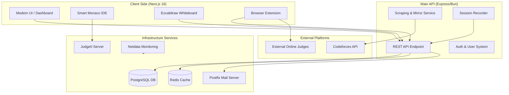

<p align="center">
  <a href="https://icpchue.com/">
    
  </a>
</p>

<div align="center">

# ICPC HUE

### The Ultimate Competitive Programming Platform

<br/>


<a href="https://icpchue.com"></a>
<a href="https://chromewebstore.google.com/detail/verdict-helper/jeiffogppnpnefphgpglagmgbcnifnhj"></a>
<a href="https://github.com/YUST777/icpchue_community/issues"></a>

<a href="LICENSE"></a>
<a href="https://github.com/YUST777/icpchue_community/discussions"></a>


</div>

<br/>

<div align="center">
  <a href="https://youtu.be/tH--wuGCMuM">
    
  </a>
  <br>
  <p><i>👆 Click to watch the demo</i></p>
</div>

<br>

> [!TIP]
> **New!** Mirror Mode allows you to practice Codeforces problems directly on ICPC HUE with a distraction-free IDE, live test case execution, and drawing board support!

---


## ICPC HUE Overview

ICPC HUE is a next-generation competitive programming platform designed to help you solve problems without limits. We provide a seamless, distraction-free environment for practicing, competing, and analyzing algorithms.

**Key Capabilities:**

- **Mirror Mode**: Scrape and solve problems from platforms like Codeforces instantly.
- **Smart IDE**: Integrated Monaco editor with multi-language support and custom snippets.
- **Whiteboard**: Built-in Excalidraw integration for visualizing algorithms.
- **Analytics**: Detailed submission analysis, complexity estimation, and performance tracking.
- **Browser Extension**: Seamlessly submit code from ICPC HUE to external judges.
- **Session Library**: Full recording and playback of your coding sessions for deep review.
- **Gamification**: Competitive leaderboards and achievements to track your progress.
- **Professional Curriculum**: A guided path curated to take you to the ICPC World Finals goal.


## Features

### Mirror Mode
Why switch tabs? Bring the problem to you. paste any Codeforces URL into ICPC HUE, and we'll instantly generate a clean, distraction-free workspace with:
- **Parsed problem statements** (MathJax supported)
- **One-click test case import**
- **Live status updates** for submissions

### ⚡ Integrated Environment
- **Multi-language Support**: C++, Python, Java, and more.
- **Custom Compilers**: Configure your own compilation flags.
- **Test Case Manager**: Add, edit, and run custom test cases locally.

### 🧠 Algorithm Visualization
Stuck on a graph problem? Use the built-in collaborative whiteboard to:
- Draw graphs and trees
- Trace algorithms visually
- Save and export your logic diagrams

### 🎥 Session Library
Review your journey. ICPC HUE automatically records your coding sessions, allowing you to:
- **Replay your solutions** step-by-step to find better optimizations.
- **Analyze your thinking patterns** through a time-sequenced library of all your solves.
- **Share recordings** with mentors for high-fidelity code reviews.

### 🏆 Gamification & Progression
Coding is more fun when you're winning. Stay motivated with a full gamification layer:
- **Global Leaderboards**: See how you rank against the best competitive programmers worldwide.
- **Achievement System**: Unlock rewards and badges as you master new algorithms and data structures.
- **Consistency Streaks**: Keep your momentum alive with daily practice goals and streaks.

### 🎓 World-Class Curriculum
Follow a battle-tested path to excellence. Our curriculum is designed to take you from the basics to the ICPC World Finals:
- **Tiered Learning Layers**: From Level 0 (Fundamentals) to Level 3+ (Advanced Graph Theory & Geometry).
- **Curated Problem Sets**: Hand-picked problems from Codeforces, CodeChef, and AtCoder that maximize learning efficiency.
- **Goal-Oriented Milestones**: Track your progress towards "ICPC-Ready" status with granular curriculum tracking.

---

## 🔒 Security & Privacy
ICPC HUE is committed to transparency and security. By open-sourcing our entire platform, we allow the community to audit our code, contribute improvements, and ensure that our tools remain safe, secure, and respectful of user privacy.

## Quick Start

1. **Visit**: [icpchue.com](https://icpchue.com)
2. **Setup Locally**: Clone this repo and follow our [Installation Guide](docs/INSTALLATION.md) (or see the [Quick Start](#quick-setup)).
3. **Install Extension**: [Download Here](https://chromewebstore.google.com/detail/verdict-helper/jeiffogppnpnefphgpglagmgbcnifnhj)

---

## Quick Setup

1. **Clone & Install**:
   ```bash
   git clone https://github.com/YUST777/icpchue-community.git
   cd icpchue-community
   pnpm install
   ```
2. **Docker**:
   ```bash
   docker compose up -d --build
   ```

---

## Community & Support
- **Bug Reports**: Found a glitch? [Open an Issue](https://github.com/YUST777/icpchue-community/issues/new)
- **Feature Requests**: Have an idea? [Request a Feature](https://github.com/YUST777/icpchue-community/issues/new)
- **Discussions**: Join the conversation in [Discussions](https://github.com/YUST777/icpchue-community/discussions)

---

## Roadmap

### June 2, 2026: Core Platform
**Instant Codeforces mirror**, VS Code + Whiteboard workflow, local judge, and analytics. We solved the 15s tab-switching headache.

### Q3 2026: National Expansion
**Making the platform accessible to all Egyptian Universities.** Our goal is to unify the competitive programming community across the country. 
> [!NOTE]
> Contact us on Telegram [@yousefmsm1](https://t.me/yousefmsm1) to add your college to the platform.

### Future: Multiplayer Rooms
**Real-time collaborative coding rooms.** Send a link to a friend, recruiter, or professor and solve hard problems together on the cloud.

## Repository Structure



- `/next-app` - Next.js 16 frontend and API routes.
- **Browser Extension** - [Source Code](https://chromewebstore.google.com/detail/verdict-helper/jeiffogppnpnefphgpglagmgbcnifnhj) of the ICPC HUE Browser Extension.
- `/scripts/scraping` - Puppeteer-based Codeforces scraping service.
- `/scripts` - Database and maintenance utilities.
- `/infrastructure` - Docker configurations for Judge0, Mail, and Monitoring.
- `/docs` - Comprehensive documentation and security policies.

---

## Support the Project

**Love ICPC HUE?** Give us a ⭐ on GitHub! It helps us grow and keep the platform free.

<div align="center">
  <sub>Built with ❤️ by Competitive Programmers, for Competitive Programmers.</sub>
</div>
